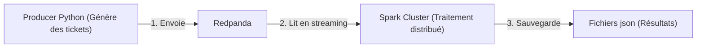
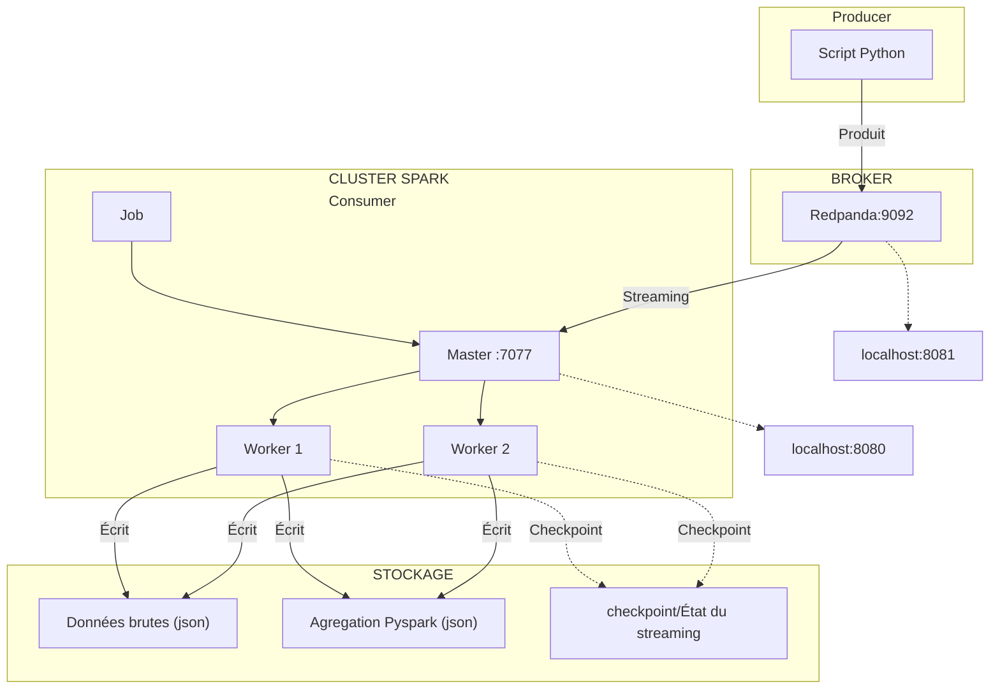

# Pipeline de Streaming Temps Réel avec Redpanda et PySpark

## 1. Introduction

Ce projet est un POC d'une pipeline de streaming temps réel pour la gestion de tickets clients. Il illustre les concepts fondamentaux du traitement de données en temps réel avec des technologies modernes l'objectif de ce POC est de : 

- Comprendre le fonctionnement d'un système de streaming de données
- Découvrir l'architecture **Producer-Broker-Consumer**
- Apprendre à utiliser **Apache Spark** pour le traitement distribué
- Manipuler **PySpark Structured Streaming**
- Conteneuriser l'ensemble avec **docker-compose** 


## 2. Installation

### 2.1. Prérequis
Avant de pouvoir utiliser ce projet, assurez-vous d'avoir installé les éléments suivants :

- **Docker** et **Docker-Compose** : pour déployer les conteneurs MongoDB, Python et Mongo Express. 
  - [Installer Docker](https://docs.docker.com/desktop/) 
  - [Installer Docker Compose](https://docs.docker.com/compose/install/)


### 2.2. Procedure pour déclancher la pipline

Après avoir deziper et accédez au dossier, vous devez créer les dossiers  nécessaires à la sauvegarde des fichier avec des  avec des droits élargies. 

```bash
mkdir -p output checkpoint
sudo chown -R 185:185 output checkpoint
sudo chmod -R 775 output checkpoint
```

Puis lancer la pipeline par construction docker. 

```bash
docker-compose up -d
```

cette commande réalise les étapes suivantes en temps réel: 

1. Un conteueur Python génère des tickets clients de façon quasi-continue (toutes les 2 secondes)
2. Ces tickets sont envoyés à **Redpanda** conteneursié qui joue le rôle de broker de messages. 
3. Plusieurs conteneur **Spark**  organise la consommation et le traitement du flux de tickets en temps réel. 
4. Les résultats sont sauvegardés dans des fichiers json 




## 3. Diagramme détaillé de la pipline

Dans cette section, nous schématisons le flux de données en détaillant le fonctionnement du cluster Spark utilisé dans ce projet.

Le cluster est composé des éléments suivants :

- Un conteneur Spark Job qui est chargé de soumettre et de lancer le script PySpark (notamment le job de streaming).
- Un conteneur Spark Master  qui reçoit les jobs, planifie les tâches et les distribue aux workers.
- Deux conteneurs Spark Worker qui exécutent les tâches qui leur sont assignées par le Master et réalisent le traitement distribué des données en streaming.



